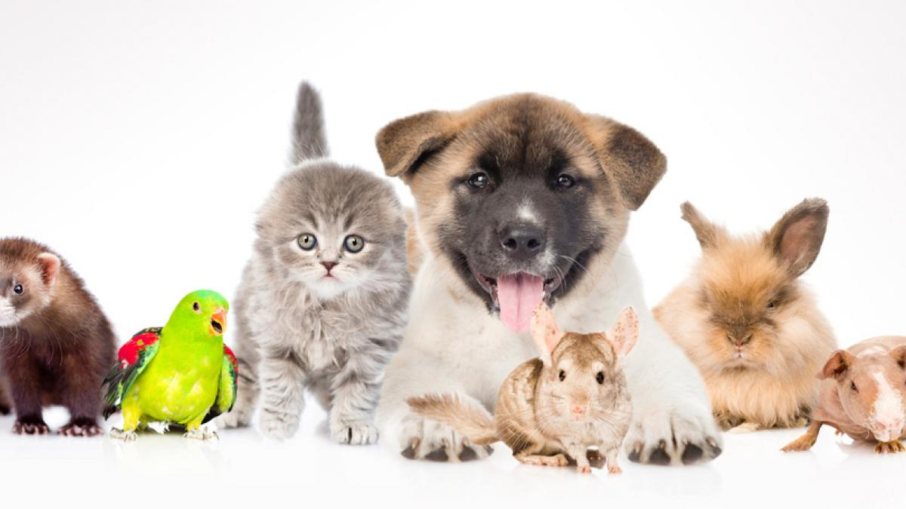

# Clasificador de Mascotas

Aplicación hecha en _Streamlit_ que carga un modelo previamente entrenado para clasificar mascotas en función del peso, la altura, el color de ojos y el largo del pelo.

